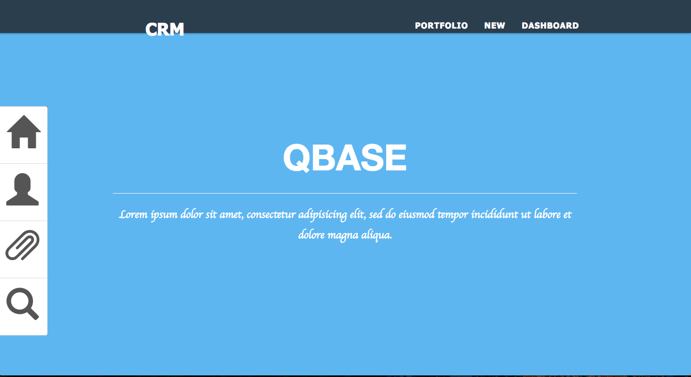
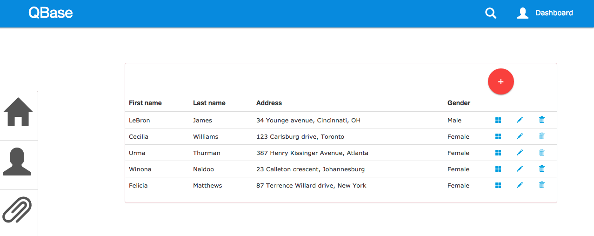
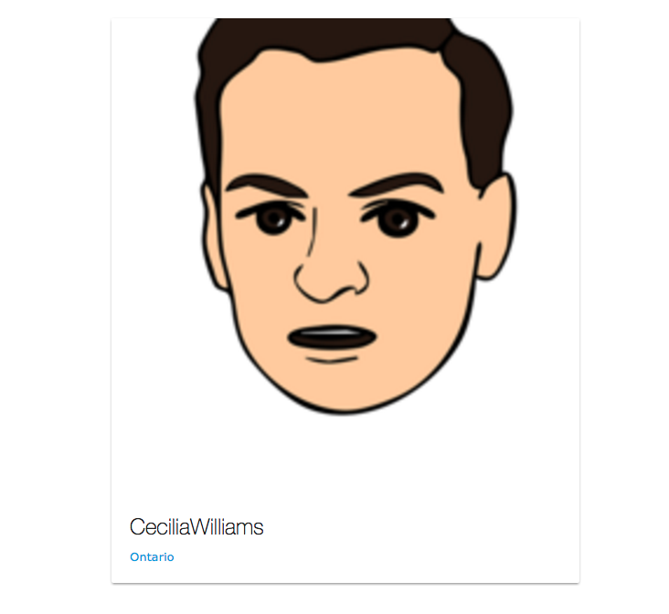
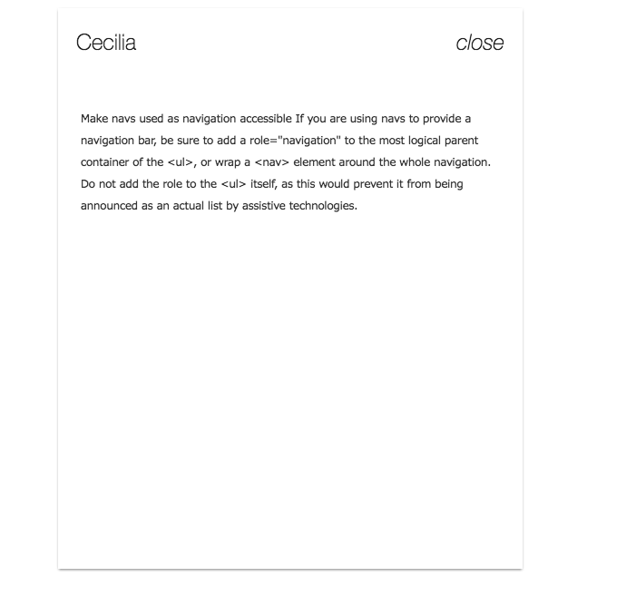

[](https://travis-ci.org/thandon263/tilr-webcrm)


# QBASE CRM
===

## Customer Relationship Management System
---
A Customer Relationship Management Application built using Ruby on rails. To manage user information. This app is using the Random User Generator API which
an open source API that can generate over 5000 user per request.


---
* To Download the APP you can use the zip [Download](https://github.com/thandon263/tilr-webcrm/archive/master.zip)

* You can clone the repository:

```console
 $  git clone git@github.com:thandon263/tilr-webcrm.git
```
----
Users will populate as soon as the document loads. User information is placed in
cells, fields and records. This application makes use of the cloud bucket from AWS you can switch from local to cloud by changing to fog. ``` gem fog ``` upload file.

### USER INFORMATION



* Each user show page has description and user name, state and the avatar. Which is made from a pallete Jumbotron ```div``` with scss and the main stylesheet to format the HTML.

USER Show:


To view the description text, you have to click on the image name. It will trigger an slide the text over the image. If you click on the image there will be a cloud or obscure foreground.

Description:


===
To view the app on herokuapp. Use This Link [QBase](https://qbase.herokuapp.com)


## DISCLAIMER
---
